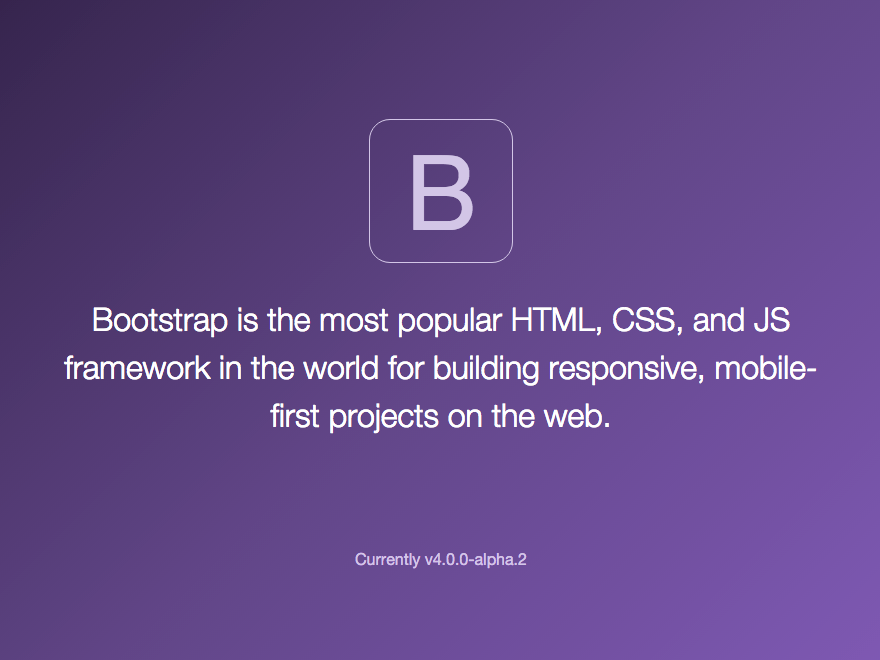

WP-Bootstrap4
=============

---

(_At the time of release Bootstrap 4 is in version 4.0.0-alpha.4_)

This theme is based on the [v4-dev](https://github.com/twbs/bootstrap/tree/v4-dev) branch, last pull dated 12-Sep-2016 - [#13e4348](https://github.com/twbs/bootstrap/commit/13e4348dfd78c0f1a28d5a108a4ec4f55de1271a).

---

Introduction
------------

A responsive Wordpress blogging theme based on [Bootstrap 4](http://v4-alpha.getbootstrap.com).

Unlike [WP-Bootstrap2](https://github.com/vinorodrigues/wp-bootstrap2) that started with *_S*, this project written from the ground up to cut out a lot of clutter.

This implies certain considerations:
* The theme is not multi-language, no l10n (localization) exists.  It's only in English.
* RTL (right-to-left language) is also excluded
* Common class names used in WP Core have been removed. As few non-Bootstrap class names as possible is the approach taken.
* Assistive technologies are excluded in this initial release.  This will be updated later.

Grunt - SCSS, JS-min, Image-Min
-------------------------------

This project uses the [Grunt](http://gruntjs.com) CLI (Command Line Interface) to process (complie / compress) the scss styles, js scripts and image files.

* A functonal intallation of Grunt is assumed. (See how to [get started](http://gruntjs.com/getting-started).)
* To initialise the project run `npm install`. This will initalise the dependancied into the `node_modules` folder.
* To complie / compress all `scss`, `js` and images run:
	- `grunt`
* To start the watch process in development environmants run:
	- `grunt watch`

Licences
--------

- Theme _(this work)_ under [MIT License](http://www.gnu.org/licenses/gpl.html)
- [Bootstrap 4](http://v4-alpha.getbootstrap.com) under [MIT License](http://www.apache.org/licenses/LICENSE-2.0)
- [Font Awesome](http://fortawesome.github.io/Font-Awesome/) under [SIL OFL 1.1](http://scripts.sil.org/OFL)
- [Wordpress](http://wordpress.org) under [GPLv2](http://www.gnu.org/licenses/gpl-2.0.html)
- [Node.js](http://nodejs.org) and [Grunt](http://gruntjs.com) have propriatory licences.  Thier source is not included in this project.

★
